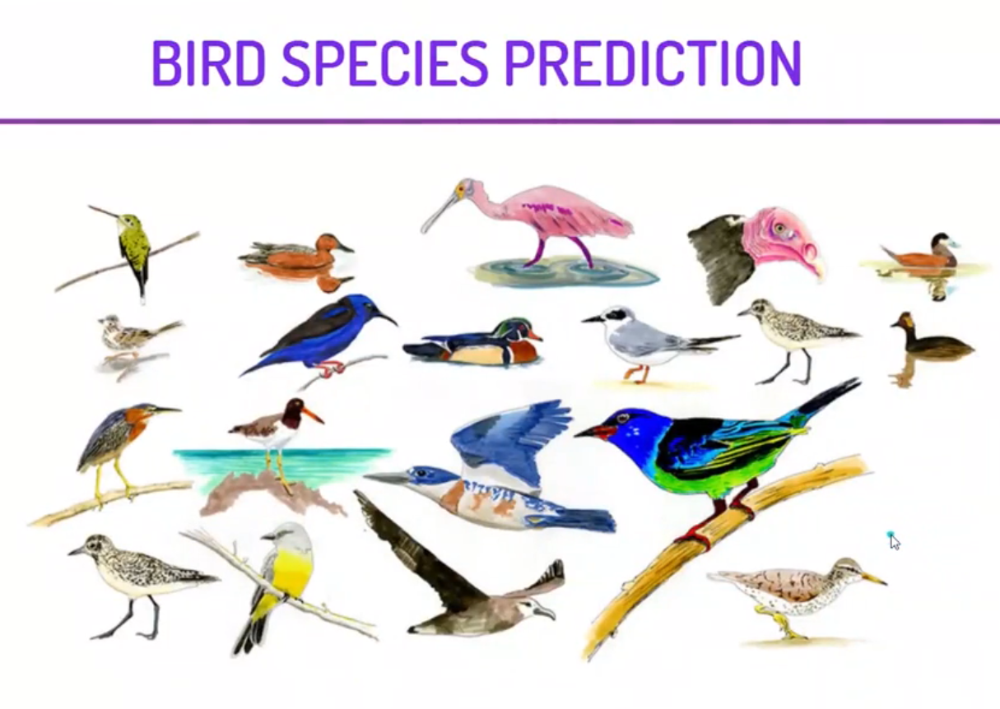

  
 

<i>

<i> IN THIS PROJECT, WE WILL CREATE A CONVOLUTIONAL NEURAL NETWORK WHICH WILL BE ABLE TO PREDICT SPECIESOF A BIRD. WE WILL USE DIFFERENT LAYERS AND OTHER HYPERPARAMETERS FOR BUILDING, TRAINING, AND TESTING THIS MULTICLASS CLASSIFICATION MODEL. WE WILL BE USING KERAS FOR THIS PROJECT.

 

  <h2> The Steps to solve the problem </h2>

1. MOUNTING GOOGLE DRIVE ON COLLAB NOTEBOOK.  
2. VISUALIZING THE IMAGES THAT WE WILL BE WORKING ON.  
3. ANALYZING THE DIMESNIONS TO VERIFY IF ALL IMAGES HAVE SAME DIMENSIONS.  
4. CONVERTING THE IMAGES INTO A NUMPY ARRAY AND NORMALIZE THEM.  
5. CHECKING CLASS IMBALANCE.  
6. SPLITTING THE DATA AND PERFORMING ONE-HOT ENCODING.  
7. CREATING THE MODEL ARCHITECTURE, COMPILING THE MODEL AND THEN FITTING IT.  
8. PLOTTING THE ACCURACY AND LOSS AGAINST EACH EPOCH.  
9. PREPROCESSING THE TEST DATA AND MAKE PREDICTIONS ON IT.  
10. VISUALIZING THE ORIGINAL AND PREDICTED LABELS FOR THE TEST IMAGES. 

  
  

<i>THIS PROJECT CAN BE USED FOR EDUCATIONAL PURPOSES TO GET A BETTER UNDERSTANDING OF HOW TO CREATE NETWORK ARCHITECTURE FOR A CNN MODEL. YOU CAN FURTHER HYPERPARAMETER TUNE THIS MODEL TO REACH HIGHER ACCURACY. IT CAN BE USED BY BIRD SANCTUARIES TO IDENTIFY DIFFERENT TYPES OF BIRDS. 

     
  
  <h2> <i>Flask Web App  </i> </h2>

<i>SThis is the second part where we build the web application using the framework Flask We mount the model we build in the previous part on the Flask project

     
  
  
  <h1> Screenshots </h1>
  <h2> Input Screen </h2>
 

  
    
  
<h2> Output Screen </h2> 

   
    

### Give It a Star if you liked the project 
